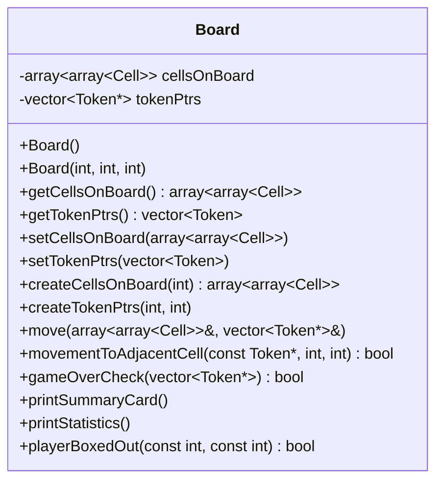
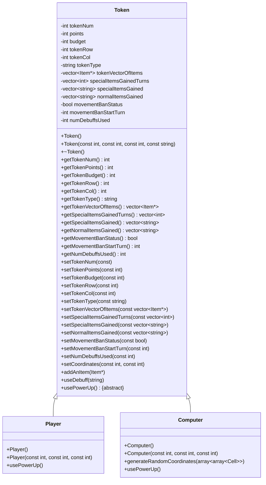
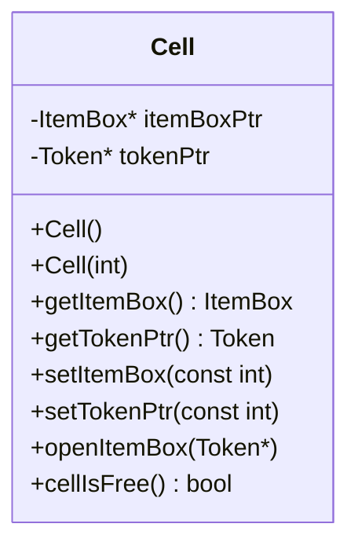
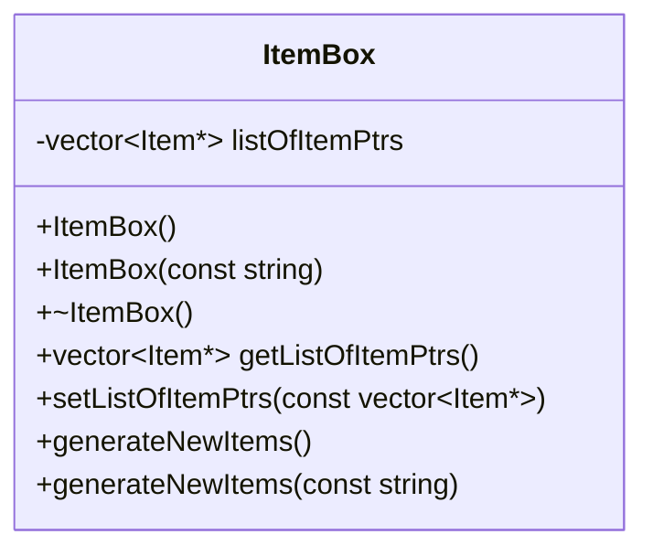
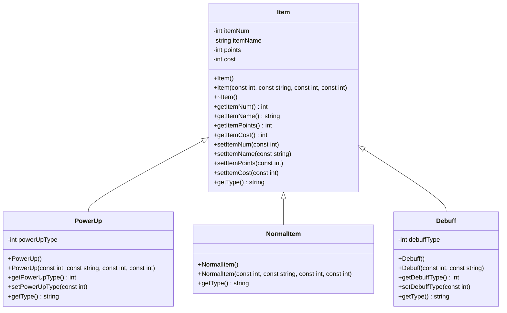

# Compilation Insutrctions
Compiling this project is simple, just run `g++ *.cpp` as well as what every you would like to call the executable. Ex. `g++ *.cpp -o pr2`
 As this project was created with C++ 14 you may consider adding that flag in. Ex. `g++ -std=c++14 *.cpp -o pr2`
# Execution Instructions
Simply execute the file you created after compiling the code. Ex. `.\pr2.exe`
# Project Status
### Completion Status
Fully completed, properly deallocates all dynamically created pointers, prints Token statistics to a file as well as to the screen when desired.
### Bugs/Issues
No known bugs or issues present
### Incomplete Features
No known incomplete features
# Manual
The goal of this game - **Shopping Spree Showdown** - is to manuever around a 5x5 grid of Cells collecting as many high-value items as possible while hopefully not obtaining too many Debuffs. After you decide a Cell to move to you will gain 2 random items. These items could be Power Ups, Normal Items or even Debuffs. The game is made up of Tokens - you the player, as well as computer(s) - which will be navigating the grid to obtain said items.
### Tokens
Tokens are just the Base class of Players and Computers.
* A ***Player*** is a real human (you the user) picking where you would like to go, use a power up, etc.
* A ***Computer*** is also a Token however it is just one where everything is determined randomly - movement, power up use, etc.
### Item Initialization
Items are initialized according to how the user wants them to be initialized. You can pick from 3 (three) files with their own unique themes or you can have the items be initialized randomly.
### Items
There are three major kinds of Items in this game that will be gained and used to potentially help or hinder you throughout the game. These items are Power Ups, Normal Items, and Debuffs.
  **There are three types of Power Ups in the game:**
 &ensp;&ensp;&ensp;(Power Ups can be used at the beginning of each Tokens turn.)
* A Power Up can be a *Point Surge* - giving you more points when used.
* *Budget Boost* - this Power Up gives you more money which will enable you to acquire more items.
* The last Power Up is a *Refund Request* allowing you to refund a Normal Item of your choice for a full refund of both points and cost.

**Normal Items are items that will reduce your budget but also give you points**
* A Normal Item is just an item that has a cost and will give you points. The amount of points and cost are specified by the 3 seperate files of items, if you decided for the items to be initialized randomly these values are generated on runtime rather than from a file. These are the items that can be refunded using the *Refund Request*.

**There are three different types of Debuffs in the game**
 &ensp;&ensp;&ensp;(All Debuffs are applied automatically as they are gained for each Token.)
* *Monetary Drain* - This Debuff reduces you budget yet gives you no points in return.
* *Item Vanish* - This Debuff removes a random item from your inventory with no refund.
* *Movement Ban* - This Debuff prohibits the Token from moving for the turn it is gained and the next turn.
## Movement/Turns
Each turn will start with you picking an adjacent Cell to move to. If this Cell already has a Token present you will be asked to enter a new Cell. However before you get to move you will be asked if you would like to use a Power Up - whether you have one or not. If you are boxed in by your opponents you will be moved to a random cell. Then at the end of your turn you will get a prompt to just enter a key so you know what you gained that turn and your current (end of turn) Points and Remaining Budget.
# UML Class Diagrams

